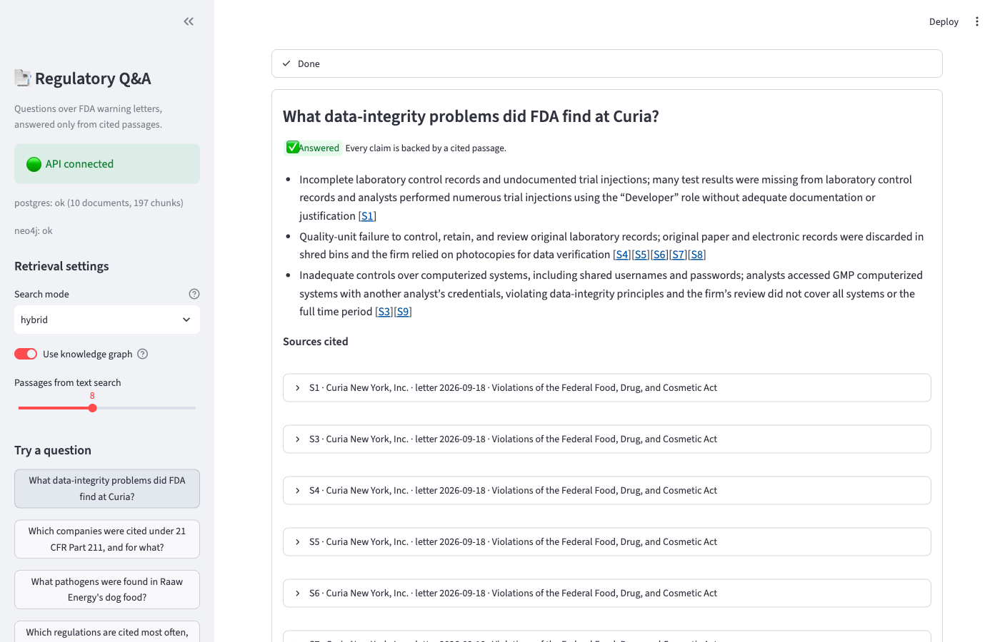
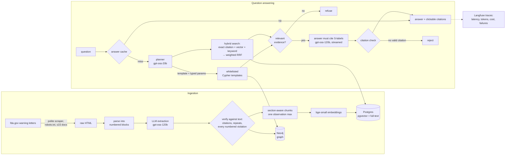

# Regulatory Q&A

Ask questions about FDA warning letters and get answers that cite the exact passages they come
from, or an explicit "not in the letters" when the sources don't support one.

> *Which companies were cited under 21 CFR Part 211, and for what?*
> *What did FDA say about out-of-specification investigations at firms cited under 21 CFR 211.192?*
> *How much was Bentley Laboratories fined?* → refused: the letters don't say.



It combines a **knowledge graph** (Neo4j) for structural questions (who was cited for what, under
which regulation, when) with **hybrid search** (pgvector + Postgres full-text + exact citation
lookup) for questions about what the letters say, and refuses rather than guesses at three points.

## Results at a glance

Measured on a hand-written set of 45 questions over 10 warning letters
([methodology](eval/README.md), [full tables](eval/results/summary.md)).

| Retrieval (36 labelled questions) | Recall@5 | MRR@10 |
|---|---|---|
| Vector search only | 0.76 | 0.69 |
| Hybrid (vector + keyword + exact citation, fused) | 0.89 | 0.85 |
| **Hybrid + planner + knowledge graph** (shipped) | **0.97** | 0.83 |

| Answers (45 questions, full system) | |
|---|---|
| Unanswerable questions correctly refused | **7 / 7** |
| Answerable questions wrongly refused | 0 / 38 |
| Key-fact recall | 1.00 |
| Faithfulness (LLM judge, verified to catch planted fabrications) | 1.00 |
| Answers rejected by the citation check | 0 |

Caveats are real: the retrieval pipeline was tuned on this same question set, the corpus is small
(one question moves recall@5 by ~0.03), and the judge is the same model family as the answerer.
See [what failed](#what-failed-and-how-i-fixed-it) for how the numbers got here.

## Architecture



Graph schema (from the build plan, plus evidence links so graph results are citable):

```
(Company)-[:OWNS]->(Site)-[:INSPECTED_IN]->(Inspection)-[:HAS_OBSERVATION]->(Observation)
(Observation)-[:CITES]->(Regulation)-[:PART_OF]->(Regulation)   // 21 CFR 211.192 → Part 211
(Observation)-[:CATEGORY]->(Topic)
(Observation)-[:EVIDENCED_BY]->(Chunk)-[:FROM]->(Document:WarningLetter)
(WarningLetter)-[:ISSUED_TO]->(Company), (WarningLetter)-[:BASED_ON]->(Inspection)
```

| Layer | Choice |
|---|---|
| API | FastAPI + Pydantic; JSON or server-sent events |
| LLMs | Groq: `gpt-oss-120b` (extraction, answers), `gpt-oss-20b` (planner, eval judge) |
| Vector + keyword | Postgres 16 + pgvector (HNSW) + `tsvector` full-text |
| Graph | Neo4j 5 |
| Embeddings / reranker | `BAAI/bge-small-en-v1.5`, `ms-marco-MiniLM-L-6-v2` (local) |
| UI | Streamlit |
| Observability | Langfuse v4, self-hosted |
| Packaging | Docker Compose: one CPU-only image for the API and UI, plus Postgres, Neo4j and optional Langfuse |

## Quickstart

Requires Docker and a [Groq API key](https://console.groq.com).

```bash
cp .env.example .env                       # add GROQ_API_KEY; set passwords
docker compose up -d --build               # Postgres, Neo4j, API (:8000), UI (:8501)

docker compose exec api python -m app.ingest.pipeline         # parse → chunk → embed → load
```

The repo includes the 10 indexed letters (`data/raw`, public FDA documents) and their cached LLM
extractions (`data/extracted`), so the pipeline rebuilds both databases in about 20 seconds with
no scraping and no LLM calls. To fetch more letters (up to 15) and extract them:

```bash
docker compose exec api python -m app.ingest.fda_scraper 15
docker compose exec api python -m app.ingest.pipeline
```

Open the UI at http://localhost:8501 and the API docs at http://localhost:8000/docs.
`./data` is mounted into the API container, so fetched letters and cached extractions persist.

Optional tracing: generate the `LANGFUSE_*` secrets in `.env` (see `.env.example`), then
`docker compose --profile observability up -d`; Langfuse is at http://localhost:3000 and its
project and API keys are created on first start.

If another Postgres already listens on 5432, set `POSTGRES_PORT=5433` in `.env` (containers talk
to each other on internal ports, so only host access changes).

**Local development** without containers for the app (data services still in Docker):

```bash
uv sync
docker compose up -d postgres neo4j
uv run uvicorn app.api.main:app --reload --port 8000
uv run streamlit run ui/streamlit_app.py
```

The image is CPU-only: on Linux, PyTorch resolves to the CPU build (`[tool.uv.sources]` in
`pyproject.toml`), which drops ~15 CUDA packages, and the embedding and reranker models are baked
in so containers start without network access.

## API

| Endpoint | |
|---|---|
| `POST /ask` | `{"question": "...", "stream": false}` → answer, status, citations, route, graph rows, timings, cost, trace id. `stream: true` returns SSE events `plan`, `sources`, `token`…, `done`. |
| `POST /ingest` | Background job: optionally fetch new letters, then run the pipeline. One at a time (409 otherwise). |
| `GET /ingest/{id}` | Job status. |
| `GET /documents`, `GET /documents/{id}` | Letters with metadata, extracted observations and passages. |
| `GET /chunks/{id}` | One passage; the target of every citation. |
| `GET /health` | Postgres and Neo4j status (503 if either is down). |

Every answer has a `status`: `answered`, `flagged` (shown, but some checks failed), `refused`
(the letters don't support an answer) or `rejected` (the draft had no valid citation, so it isn't
shown).

## How it works

**Ingestion.** Letters are parsed into numbered blocks (headings, paragraphs, list items,
footnotes, with redactions like `(b)(4)` kept inline). `gpt-oss-120b` extracts the site,
inspection and each violation as a block range with a summary, regulations and topics from a
fixed list. Its output is then checked against the text in code:

- every numbered violation paragraph must start an observation; missed ones are re-requested
- a regulation is kept only if a regex scanner also finds it in the letter
- "repeat observation" is kept only if the text mentions a prior inspection

Chunks never cross an observation boundary, so each observation links to the passages that
prove it.

**Answering.** A planner routes each question (structural, semantic or both) and may fill one of
seven Cypher templates. The LLM never writes Cypher: templates are built from constant fragments,
values are bound parameters, and everything runs read-only with a timeout and row limit. Text
search fuses an exact CFR-section lookup, vector search and keyword search with weighted
reciprocal rank fusion, searching both the question and the planner's rewrite.

**Refusing instead of guessing**, cheapest first:

1. Before any LLM call: unknown company, empty graph result, or nothing relevant retrieved.
2. The model replies `NOT_FOUND` when its sources don't cover the question.
3. After generation: an answer without a valid citation is rejected; invented citation labels are
   stripped and flagged; mostly-uncited answers are flagged.

## Evaluation

```bash
uv run python -m eval.run_eval              # retrieval comparison, ~1 min, no LLM calls
uv run python -m eval.run_eval --answers    # + answers and LLM judge (resumable; Groq free tier is slow)
uv run pytest                               # 52 offline unit tests
uv run pytest -m eval                       # regression gate against eval/thresholds.json
RUN_ANSWER_EVAL=1 uv run pytest -m eval     # gate including answers and a judge sanity check
```

The gate fails if retrieval drops below its thresholds, if the full system stops beating
vector-only search by at least 0.10 recall@5, or if exact-citation questions lose any recall.
Disabling the exact-citation search, as a test, fails two gate checks.

## Observability and caching

With the `observability` profile up, every `/ask` becomes a Langfuse trace with typed child spans:
`plan` (generation), `graph` (tool), `search` (retriever), `answer` (generation), `citation_check`
(guardrail). Token usage and list-price cost are recorded on each generation; rejected or flagged
answers are marked `WARNING`, failures `ERROR`. Tracing is a no-op without Langfuse keys.

Answers are cached in Postgres by exact match on the normalized question, the retrieval settings,
a hash of the models and prompts, and a data version, so re-ingesting or changing a prompt
invalidates entries automatically. It is deliberately not a semantic cache: "What did FDA find at
Bentley?" and "…at Babikian?" embed almost identically, and a near-duplicate hit would return the
wrong company's violations.

Before/after on repeated questions ([full table](eval/results/cache.md); 2 questions measured
so far, the rest pending Groq's daily quota):

| | Cold (miss) | Warm (hit) |
|---|---|---|
| Latency (median) | 20.6 s | 5 ms |
| LLM tokens | ~2,382 | 0 |
| Cost (list price) | $0.00053 | $0 |
| Identical answer and citations | | 2/2 |

Cold latency includes free-tier rate-limit waits; the cache only helps repeated questions.

## What failed and how I fixed it

Each of these was found by looking at actual outputs or eval numbers, not by inspection.

**Ingestion**
- **Extraction silently skipped violations.** The LLM returned 3 of 6 misbranding items for one
  letter and merged three numbered items into one for another. Fix: a code check that every
  numbered violation paragraph starts an observation, with a focused follow-up call for misses.
- **The LLM invented a repeat-violation flag.** It read "repeated occurrences of this practice"
  (within one inspection) as an FDA repeat observation (cited at a prior inspection). Fix: the
  flag is kept only if the observation's text mentions a previous inspection.
- **Long letters exceeded the provider's per-request token limit.** Fix: render boilerplate-free
  and shrink list items first, keeping block indices so spans still refer to the full text.

**Retrieval**
- **Exact citations ranked badly.** For "21 CFR 211.192", the common tokens "21" and "cfr"
  outranked the one rare token that mattered. Fix: a separate exact-section list with 3× weight
  in rank fusion.
- **The reranker made ranking worse.** The MiniLM cross-encoder lowered recall@5 from 0.89 to
  0.86 when allowed to reorder. Fix: keep it only as a relevance gate for refusals.
- **Graph results crowded out the passage that answered the question.** For "what did FDA say
  about X at company Y", the company's 7–11 observations filled the top slots. Fix: for mixed
  questions, pin one graph chunk per letter and rank the rest by relevance.
- **A ranking answer was wrong although every row was cited.** Only rows with loaded evidence can
  be cited, so the model dropped the 7th-ranked regulation and kept a lower one. Fix: cap
  aggregate queries at the number of rows that get evidence.

**Answering**
- **Correct answers were rejected.** The model wrote citations as `[ S3 ]` with narrow no-break
  spaces and `[​S1]` with zero-width spaces. Fix: normalize before checking (the system
  failed closed, which is the right direction).
- **A blank company name matched every company.** Required-parameter checks ran before whitespace
  was stripped. Found by a unit test.
- **A rate-limited request hung for minutes.** Daily quota errors were retried like per-minute
  ones. Fix: fail fast with a clear "try again in …" message.

**Evaluation**
- **The LLM judge scored correct answers 0.** Three bugs: it saw renumbered source labels, never
  saw the company/date headers or graph rows the answerer had, and graded quoted marketing claims
  ("changing the game for equine gastric ulcers") as if they were factual assertions. Fix: give
  the judge exactly the answerer's context; a gate test now checks it catches planted fabrications.
- **A labeling error.** One question's expected passage was too narrow; FDA describes the issue
  across several chunks. Fixed the label, not the system.

## Limitations

- 10 letters; the eval set was also used for tuning, so treat the numbers as optimistic.
- The letters are FDA's public record and name individuals (recipients, FDA staff); they are
  included as published.
- Groq's free tier allows ~200k tokens/day for the answer model, roughly 80 uncached answers.
- The judge shares a model family with the answerer (a different family didn't fit the free tier's
  limits).
- No authentication; ingest job status is in memory.
- Single-node Compose deployment; no TLS or secrets manager.

## Repository layout

```
app/
  api/main.py           FastAPI endpoints
  qa.py                 plan → retrieve → gate → generate → check
  cache.py              exact-match answer cache
  observability.py      Langfuse tracing
  ingest/               scraper, parser, citation regex, LLM extraction, chunking, pipeline
  graph/                Neo4j loader and whitelisted query templates
  retrieval/            embeddings, hybrid search, fusion, reranking
  llm/                  Groq client, planner, answer prompt and citation check
eval/                   questions, harness, thresholds, results, cache benchmark
ui/streamlit_app.py     Streamlit front end
tests/                  unit tests and the eval gate
Dockerfile              API/UI image (uv, CPU-only PyTorch, models baked in, non-root)
docker-compose.yml      Postgres, Neo4j, API, UI, and the optional Langfuse stack
```
